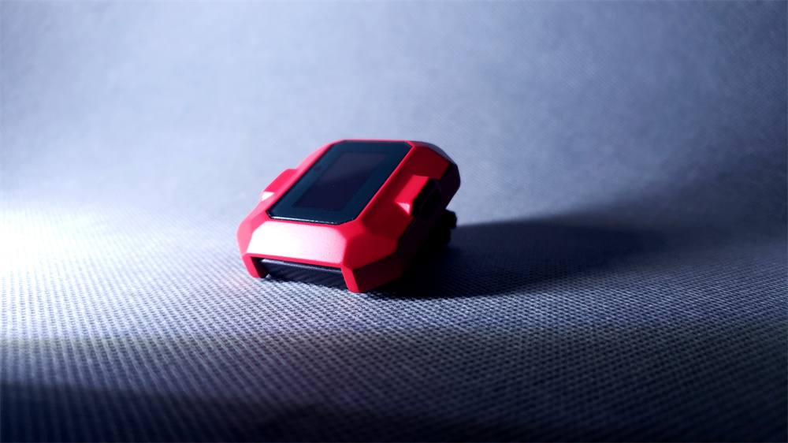
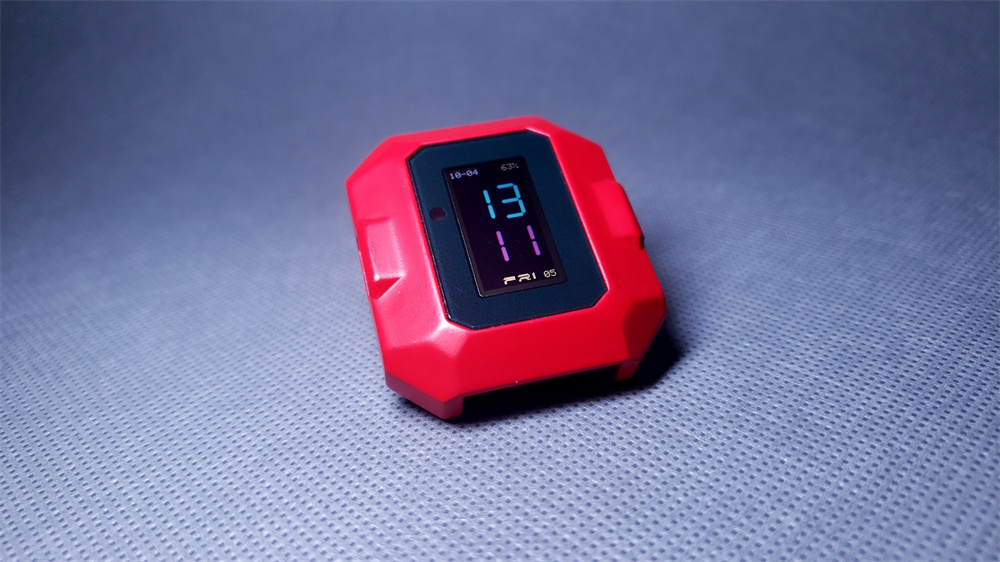
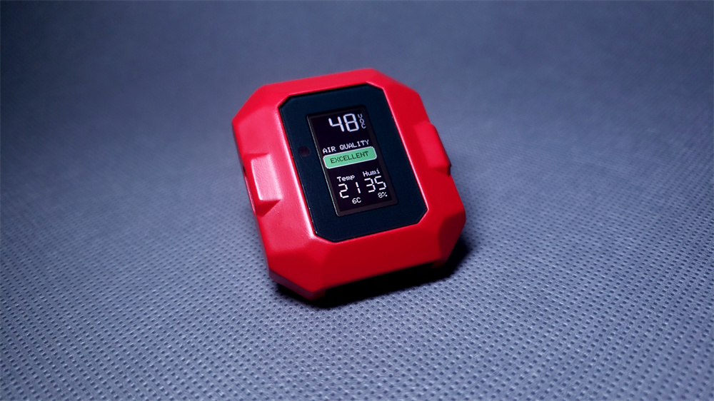
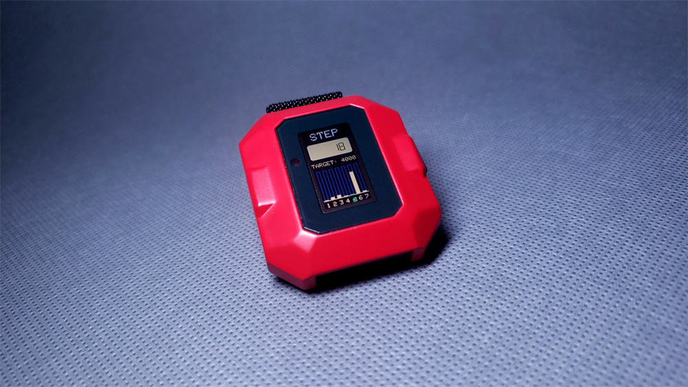
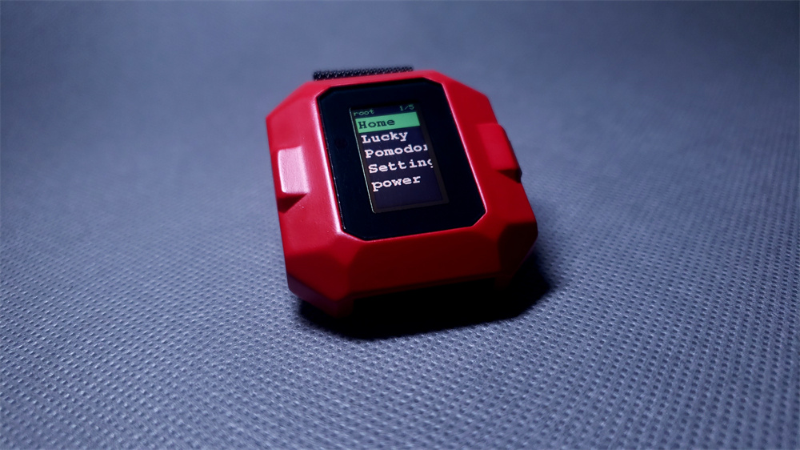
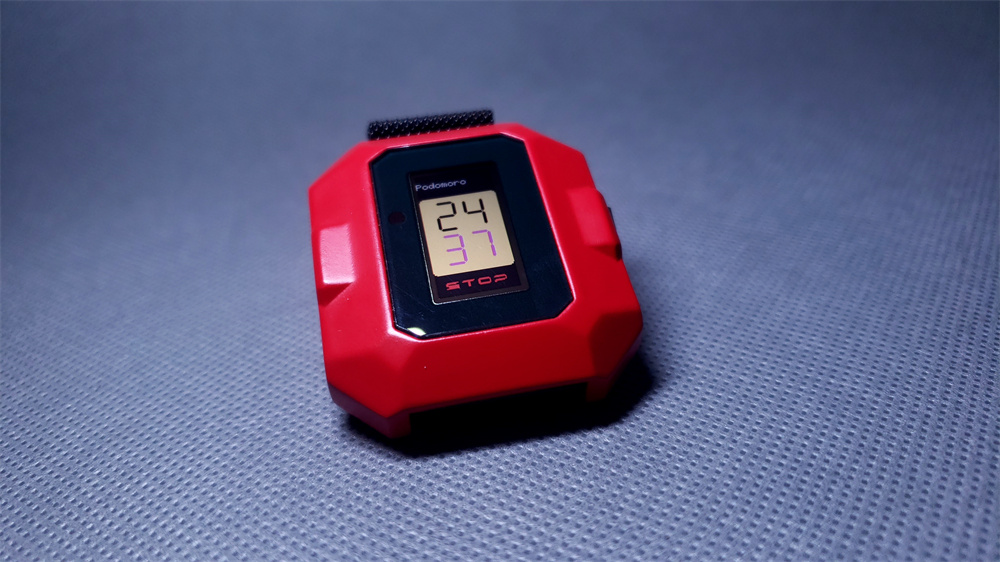
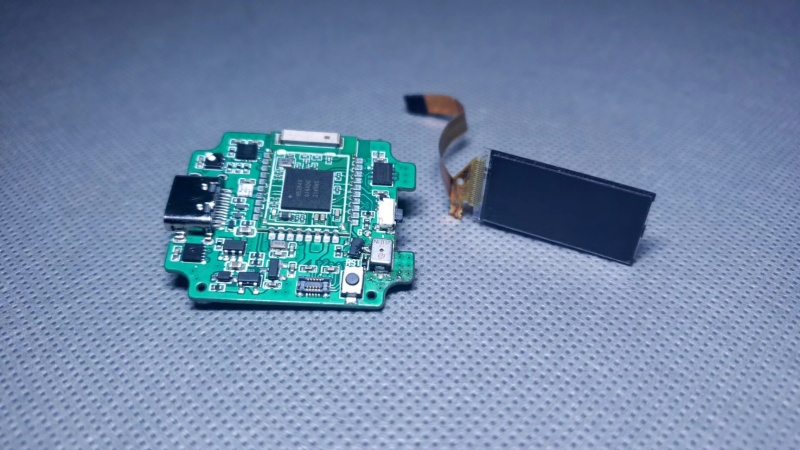
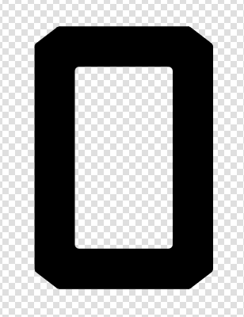
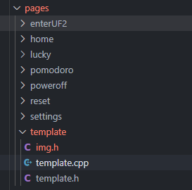

https://github.com/user-attachments/assets/3a3785d2-84e4-4510-96f3-b70b62eddb09

# FreshWatch

This is a watch that can monitor air quality, with open-source hardware and software, allowing for free programming.

# Specification

- NRF52840
- SGP40
- SHT30
- LSM6DS3TR-C
- Display: LPM009M360A (0.85inch 72*144 )
- Battery: 402030
- watch band: 20mm

# 3D Printing

[3D files](https://makeronline.com/en/model/Fresh%20Watch/48677.html)

# Hardware

PCB thickness: 0.8mm

# Mechanical

# Software

#### PlatformIO

Before burning, you need to use a programming tool like JLink to install the bootloader (see the file: freshwatch_nrf52840_bootloader-0.9.2_s140_6.1.1.hex). Then, you can compile this code and proceed with the download.

For future firmware updates, you can connect the device via USB, then enter UF2 mode through the menu, and drag the flash.uf2 file into the USB drive.

A flash.uf2 file will be automatically generated each time you compile, making it convenient for updates.

The pages directory contains content related to the various app functionalities. You can write these according to the rules in the template folder and sequentially fill in these functions.

#### CircuitPython

First, you need to burn the bootloader, then drag the firmware_9.1.1_0826.uf2 file into the generated USB drive.

This firmware uses external flash as the code storage system, so if you want to use this Python framework, you must solder the flash chip.

For further development, you can refer to the CircuitPython official website.

# License

This work is licensed under a [Creative Commons Attribution-NonCommercial-ShareAlike 4.0 International License](http://creativecommons.org/licenses/by-nc-sa/4.0/).

